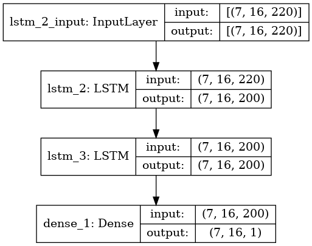

# Credit Card Fraud MMA Workload

Scope
-----------------------
This repository provides TensorFlow source code for building and training a LSTM credit card fraud model. The repository also provides table definition and User Defined Function files for the DB2 deployment of the aforementioned LSTM model for inferencing. 

Summary
-----------------------
The model uses a large dataset of approximately 25M rows of credit card transactions and it imports that using pandas and Python. Then it groups those 25M rows into groups of 7 of User-Card transactions. The LSTM looks at historical data when making predictions so the prediction it will make is for the next transaction based off the 7 done. The model is static; therefore our inputs are: (7,16,220); 7 being the 7 User-Card groupings, 16 being the batch size which is how many groupings of 7 User-Card transactions are being sent into the model at the same time and 220 is the number of features. The 220 can be received from the fitted mapper which is a sklearn DataFrameMapper which converts the categorical data into numerical data as the model obviously needs numbers to comprehend how to make a prediction.

The dataset for this repository can be found here:
----------------------
https://github.com/IBM/TabFormer/tree/main/data/credit_card

Installation
----------------------
### Prerequisites
* Linux POWER system or Linux x86 system with RHEL 8.5 or higher.
* DB2 11.5.7.0

### Create a Conda environment as the DB2 Fenced User
* `su - db2fenc1`
* `wget https://repo.anaconda.com/archive/Anaconda3-2021.05-Linux-ppc64le.sh` if you are using a Linux POWER system or                                 `wget https://repo.anaconda.com/archive/Anaconda3-2021.05-Linux-x86_64.sh` if you are using a Linux x86 system.
* `bash Anaconda3-2021.05-Linux-ppc64le.sh` and accept all the license agreements
* `source ~/.bashrc`
* `conda config —add channels conda-forge`
* `conda config —add channels http://ausgsa.ibm.com/projects/o/open-ce/conda/open-ce-r1.5.3-p10/` for POWER only!!! Skip this step if you are using an x86 system
* `conda create -n mma-env python=3.9`
* `conda activate mma-env`
* `conda install tensorflow-cpu`
* `conda install scikit-learn=1.0.2`
* `conda install pydot`
* `conda install sklearn-pandas`
* NOTE: please verify the install of libgfortran5 by running `conda install libgfortran5`

### Download the data
* Clone this repo to your work environment.
* Install the dataset linked above and import it to your work environment and put it in the same directory as the repo.

Installation
----------------------
### Running the workload outside of DB2
`python3 ccf_220_keras_lstm_static-OS.py`

Here is an image of the model architecture that is generated using tf.keras.utils at runtime:

Creating the Tables on DB2
----------------------
* Transfer the data to DB2
  * Switch the user to root as root privileges are required
  * `mv usBankWorkload/ /home/db2inst1/scripts`
  * Change the owner privileges for the directory to db2inst1
    * `chown -R db2inst1:db2iadm1 usBankWorkload/`
    * Verify that the owner of the usBankWorkload is now db2inst1 by running `ls -l`
  * Switch to db2inst1 and connect to your DB2 instance
  * Create the table
    * `db2 -tvf index_table.ddl`
    * `./import_data.sh test_220_100k.csv usbank.indexed_trans`
  * Verify that the table has been created
    * `db2 "select * from usbank.indexed_trans fetch first 10 rows only"`

Inferencing with the Model on DB2 with 1 user
----------------------
* Transfer the model to DB2
  * Move the model.h5 file into the udf directory
  * Switch the user to root as root privileges are required
  * `scp -r udf /home/db2inst1/sqllib/function/routine`
* Set the Python path in DB2 to be the same path that was used when creating the model
  * Connect to your db2 instance on the db2inst1 user using `db2 connect to test`
  * Set the Python Path `db2 update dbm cfg using PYTHON_PATH "/home/db2fenc1/anaconda3/envs/mma-env/bin/python3.9"` 
* Create the User Defined Table Function
  * `db2 "CREATE or REPLACE FUNCTION cachesys.us_bank_predict_udtf(INTEGER, INTEGER, INTEGER, INTEGER, INTEGER, INTEGER, INTEGER, CHAR(5), VARCHAR(20), VARCHAR(128), VARCHAR(128), VARCHAR(128), VARCHAR(128), FLOAT, INTEGER, VARCHAR(128), VARCHAR(4)) returns table(PREDICTION FLOAT) LANGUAGE PYTHON PARAMETER STYLE NPSGENERIC FENCED NOT THREADSAFE NO FINAL CALL DISALLOW PARALLEL NO DBINFO DETERMINISTIC NO EXTERNAL ACTION RETURNS NULL ON NULL INPUT NO SQL EXTERNAL NAME 'home/db2inst1/sqllib/function/routine/udf/us_bank_udtf.py'"`
* Run the User Defined Table Function for inferencing as a test through the command line
  * `time db2 "select PREDICTION from usbank.indexed_trans i, table(cachesys.us_bank_predict_udtf(112, i.Index, i.User_id, i.Card, i.Year, i.Month, i.Day, i.Time, i.Amount, i.Use_Chip, i.Merchant_Name, i.Merchant_City, ifnull(i.Merchant_State, ‘CA’), ifnull(i.Zip, '0'), i.MCC, ifnull(i.is_Errors, 'missing_value'), i.is_Fraud)) fetch first 112 rows only"` 
* Execute the UDF for concurrent users
  * Change directories to the db2inst1 scripts 
    * `cd /home/db2inst1/scripts` 
  * Change the `one_user.sh` and `concurrent_users.sh` to have executive permission
    * `chmod +x one_user.sh`
    * `chmod +x concurrent_users.sh`
  * Execute the concurrent_users.sh script, which will collect NMON
    * `./concurrent_users.sh`
    * The NMON file for the run will be generated in the same directory
 
Inferencing with the Model on DB2 with Concurrent Users
----------------------
 * Edit the one_user.sh and concurrent_users.sh script to have more concurrent users and fetch more than 1 batch
    * In the concurrent_users.sh script, change the value of `i` from 1 to your desired user amount (remember to collect necessary NMON_SAMPLES for time accordingly)
    * In the one_user.sh script, change the db2 select query to collect more batches
      * Essentially, you need to change the `112` value which is the product of the sequence number, 7, the static model batch size, 16, and how many batches are being passed in currently, 1. You can multiply the 112 number by a factor of how many batches you'd like to pass in; i.e if you want two batches passed in, the `112` value would be `224` and similarly if you want 3 batches passed in, the value would need to be changed to `336`.
      * The second part of this SQL query you need to change is the index less than operator at the end. You can find this number by exiting the one_user.sh script and running a query through DB2 directly. Run `db2 "select index from usbank.indexed_trans fetch first X rows only"` where X is the value you have used from the previous step (112 for 1 batch, 224 for 2 batches, 336 for 3 batches, etc). Once finished executing, copy the LAST index value you see and use that index value in the less than operator in the SQL query in one_user.sh.
    * An example of a query for two batches is: `time db2 "select PREDICTION from usbank.indexed_trans i, table(cachesys.us_bank_predict_udtf(224, i.Index, i.User_id, i.Card, i.Year, i.Month, i.Day, i.Time, i.Amount, i.Use_Chip, i.Merchant_Name, i.Merchant_City, ifnull(i.Merchant_State, 'CA'), ifnull(i.Zip, '0'), i.MCC, ifnull(i.is_Errors, 'missing_value'), i.is_Fraud)) where i.index<=7355"`
  
